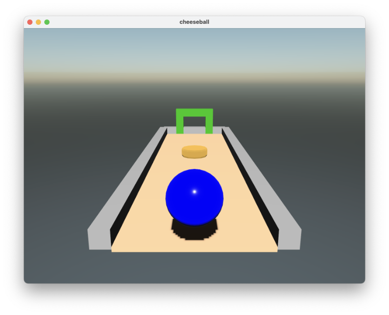
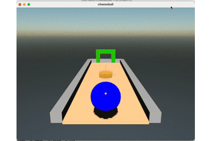
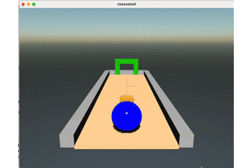
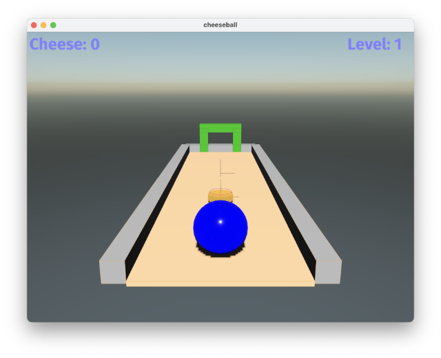
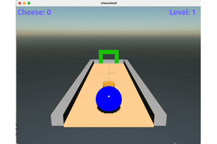
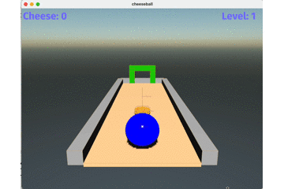
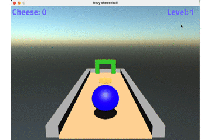

# bevy-cheeseball - creating a 3D game with rust and bevy

My third 3D game with rust(https://www.rust-lang.org) and the bevy framework(https://bevyengine.org)
using Rapier https://github.com/dimforge/bevy_rapier

I am inspired by the classic marble games like #MonkeyBall.  
    
Thanks to Kenny https://www.kenney.nl for the assets.

## 1. Step _ setup first level

Thanks to bevy_atmosphere - A procedural sky plugin for bevy https://github.com/JonahPlusPlus/bevy_atmosphere

<br><br><br><br><br><br><br><br><br><br><br><br><br><br>


```Rust
use bevy::prelude::*;
use bevy_atmosphere::*;


fn main() {
    App::new()
        //add config resources
        .insert_resource(Msaa {samples: 4})
        .insert_resource(WindowDescriptor{
            title: "cheeseball".to_string(),
            width: 800.0,
            height: 600.0,
            ..Default::default()
        })
        .insert_resource(bevy_atmosphere::AtmosphereMat::default())
        //bevy itself
        .add_plugins(DefaultPlugins)
        .add_plugin(bevy_atmosphere::AtmospherePlugin {
            dynamic: false,
            sky_radius: 11.0,
        })
        // system once
        .add_startup_system(setup)
        // system frame
        .run();
}
```


```Rust
fn setup(
    mut commands: Commands,
    asset_server: Res<AssetServer>,
    mut meshes: ResMut<Assets<Mesh>>,
    mut materials: ResMut<Assets<StandardMaterial>>,
) {
    commands.spawn_bundle(PerspectiveCameraBundle{
        transform: Transform::from_xyz(0.0,1.0,0.0).looking_at(Vec3::new(0.,0.,-4.), Vec3::Y),
        ..Default::default()
    });
    
    //light
    const HALF_SIZE: f32 = 10.0;
    commands.spawn_bundle(DirectionalLightBundle {
        directional_light: DirectionalLight {
            shadows_enabled: true,
            ..default()
        },
        transform: Transform {
            translation: Vec3::new(0.0, 4.0, 0.0),
            rotation: Quat::from_rotation_x(-std::f32::consts::FRAC_PI_4),
            ..default()
        },
        ..default()
    });
    
    // ambient light
    commands.insert_resource(AmbientLight {
        color: Color::WHITE,
        brightness: 0.02,
    });
    
    //walls
    let mut children_list:Vec<Entity> = Vec::new();
    let wall1 = commands
        .spawn_bundle(PbrBundle {
            mesh: meshes.add(Mesh::from(shape::Box::new(0.4,0.4,12.0))),
            material: materials.add( StandardMaterial{
                base_color: Color::rgb(0.5, 0.5, 0.5),
                double_sided: true,
                ..Default::default()
            }),
            transform: Transform {
                translation: Vec3::new(-1.7, 0.2, 0.0),
                rotation: Quat::from_rotation_x(0.0),
                ..Default::default()
            },
            ..Default::default()
        }).id();
    children_list.push(wall1);
    
    let wall2 = commands
        ... .id();
    children_list.push(wall2);
    let wall3 = commands
        ... .id();
    children_list.push(wall3);
    
    //door
    let door1 = commands
        ... .id();
    children_list.push(door1);
    let door2 = commands
       ... .id();
    children_list.push(door2);
    let door3 = commands
        ... .id();
    children_list.push(door3);

    //platform
    commands
        .spawn_bundle(PbrBundle {
            mesh: meshes.add(Mesh::from(shape::Box::new(3.0,0.1,12.0))),
            material: materials.add( StandardMaterial{
                base_color: Color::rgb(1.0, 0.8, 0.6),
                double_sided: true,
                ..Default::default()
            }),
            transform: Transform {
                translation: Vec3::new(0.0, -2.0, -11.0),
                rotation: Quat::from_rotation_x(0.0),
                ..Default::default()
            },
            ..Default::default()
        })
        .push_children(&children_list);
    
    //cheese
    let cheese_position = Vec3::new(0.0, -1.0, -8.0);

    commands.spawn_bundle((
        Transform::from_translation(cheese_position),
        GlobalTransform::identity(),
    ))
        .with_children(|parent| {
            parent.spawn_scene(asset_server.load("models/cheese.glb#Scene0"));
        });
    
    //ball
    commands
    .spawn_bundle(PbrBundle {
        mesh: meshes.add(Mesh::from(shape::UVSphere{
            radius:0.5,
            sectors:32,
            stacks:32
        })),
        material: materials.add( StandardMaterial{
            base_color: Color::rgb(0.0, 0.0, 1.0),
            ..Default::default()
        }),
        transform: Transform {
            translation: Vec3::new(0.0, -1.0, -5.0),
            rotation: Quat::from_rotation_x(0.0),
            ..Default::default()
        },
        ..Default::default()
    });
}
```

## 2. Step _ physics

using Rapier https://github.com/dimforge/bevy_rapier

<br><br><br><br><br><br><br><br><br><br>


```Rust
use bevy::prelude::*;
use bevy_atmosphere::*;
use bevy_rapier3d::prelude::*;

fn main() {
    App::new()
        //add config resources
        .insert_resource(Msaa {samples: 4})
        .insert_resource(WindowDescriptor{
            title: "cheeseball".to_string(),
            width: 800.0,
            height: 600.0,
            ..Default::default()
        })
        .insert_resource(bevy_atmosphere::AtmosphereMat::default())
        //bevy itself
        .add_plugins(DefaultPlugins)
        .add_plugin(bevy_atmosphere::AtmospherePlugin {
            dynamic: false,
            sky_radius: 11.0,
        })
        .add_plugin(RapierPhysicsPlugin::<NoUserData>::default())
        .add_plugin(RapierDebugRenderPlugin::default())
        // system once
        .add_startup_system(setup)
        .run();
}
```


```Rust
n setup(
    ..
) {
    ..
    //walls
    let mut children_list:Vec<Entity> = Vec::new();
    let wall1 = commands
        ..
        })
        .insert(Collider::cuboid(0.4/2.0, 0.4/2.0, 12.0/2.0))
        .id();
    children_list.push(wall1);
    let wall2 = commands
       ..
        .insert(Collider::cuboid(0.4/2.0, 0.4/2.0, 12.0/2.0))
        .id();
    children_list.push(wall2);
    let wall3 = commands
       ..
        .insert(Collider::cuboid(3.4/2.0, 0.4/2.0, 0.4/2.0))
        .id();
    children_list.push(wall3);
    //door
    let door1 = commands
        ..
        .insert(Collider::cuboid(2.0/2.0, 0.4/2.0, 0.4/2.0))
        .id();
    children_list.push(door1);
    let door2 = commands
        ..
        .insert(Collider::cuboid(0.4/2.0, 1.2/2.0, 0.4/2.0))
        .id();
    children_list.push(door2);
    let door3 = commands
        ..
        .insert(Collider::cuboid(0.4/2.0, 1.2/2.0, 0.4/2.0))
        .id();
    children_list.push(door3);

    //platform
    commands
        ..
        .push_children(&children_list)
        .insert(RigidBody::Fixed)
        .insert(Sleeping::disabled())
        .insert(Collider::cuboid(3.0/2.0, 0.1/2.0, 12.0/2.0));
    //cheese
    let cheese_position = Vec3::new(0.0, -1.0, -8.0);

    commands.spawn_bundle((
      ..
        .insert(RigidBody::Dynamic)
        .insert(Sleeping::disabled())
        .insert(Collider::cylinder(0.15, 0.3));;
    //ball
    commands
    ..
        .insert(RigidBody::Dynamic)
        .insert(Sleeping::disabled())
        .insert(Collider::ball(0.5));
}
```

## 3. Step _ move ball

<br><br><br><br><br><br><br><br><br><br>


```Rust
fn setup(
    mut commands: Commands,
    asset_server: Res<AssetServer>,
    mut meshes: ResMut<Assets<Mesh>>,
    mut materials: ResMut<Assets<StandardMaterial>>,
) {
   ..
    //ball
    commands
    .spawn_bundle(PbrBundle {
     ..
    })
        .insert(RigidBody::Dynamic)
        .insert(Sleeping::disabled())
        .insert(Collider::ball(0.5))
        .insert(ExternalForce {
            ..Default::default()
        });

}
```


```Rust
const SPEED:f32= 1.0;

fn input_user(
    keyboard_input:Res<Input<KeyCode>>,
    mut query_forces: Query<&mut ExternalForce>,
){

    let x = if keyboard_input.pressed(KeyCode::Left) {
        -SPEED
    } else if keyboard_input.pressed(KeyCode::Right) {
        SPEED
    } else {
        0.0
    };

    let z = if keyboard_input.pressed(KeyCode::Up) {
        -SPEED
    } else if keyboard_input.pressed(KeyCode::Down) {
        SPEED
    } else {
        0.0
    };

    if x != 0.0 || z != 0.0 {
        for mut ext_force in query_forces.iter_mut() {
            ext_force.force = Vec3::new(x,0.0, z);
        }
    }
}
```

## 4. Step _ display

<br><br><br><br><br><br><br><br><br><br>
<br><br>


```Rust
struct Score {
    cheese:i32,
    level:i32
}
impl Default for Score{
    fn default() -> Self {
        Self {
            cheese:0,
            level:1,
        }
    }
}

#[derive(Component)]
struct Cheesetext;

#[derive(Component)]
struct Leveltext;
```


```Rust
fn main() {
    App::new()
        ..
        .insert_resource(Score::default())
        ..
        .add_system(scoreboard)
        .run();
}
```


```Rust
fn scoreboard(
    score: Res<Score>,
    mut cheese_query: Query<(&mut Text, With<Cheesetext>, Without<Leveltext>)>,
    mut level_query: Query<&mut Text, With<Leveltext>>,
) {
    let (mut text,_,_) = cheese_query.single_mut();
    text.sections[0].value = format!("Cheese: {}", score.cheese);

    let mut level_text = level_query.single_mut();
    level_text.sections[0].value = format!("Level: {}", score.level);
}
```

## 5. Step _ get cheese

<br><br><br><br><br><br><br><br><br><br>


```Rust
fn setup(
    ..
) {
    ..
    //cheese

    commands.spawn_bundle((
   ..
        .insert(ActiveEvents::COLLISION_EVENTS)
        .insert(Cheese{});
    //ball
    commands
    .spawn_bundle(PbrBundle {
      ..
        .insert(ActiveEvents::COLLISION_EVENTS)
        .insert(Ball{});

}
```


```Rust
fn collision(
    mut collision_events: EventReader<CollisionEvent>,
    mut score: ResMut<Score>,
    query_ball: Query<Entity, With<Ball>>,
    query_cheese: Query<Entity, With<Cheese>>,
    mut commands: Commands
){
    let entity_ball = query_ball.single();
    for e in collision_events.iter(){
        //println!("{:?}",e);
        match e {
            CollisionEvent::Started(e1,e2,_) => {
                if e1 == &entity_ball || e2 == &entity_ball {
                    for entity_cheese in query_cheese.iter(){
                        if e1 == &entity_cheese || e2 == &entity_cheese {
                            commands.entity(entity_cheese).despawn_recursive();
                            score.cheese += 1;
                        }
                    }
                }
            }
            CollisionEvent::Stopped(_,_,_)=> {}
        }
    }
}
```

## 6. Step _ collision effect

<br><br><br><br><br><br><br><br><br><br>


```Rust
struct CreateEffectEvent(Vec3);
```


```Rust
fn main() {
    App::new()
       ..
        .add_event::<CreateEffectEvent>()
      ..
        .run();
}
```


```Rust
const EFFECT_SIZE:f32=0.1;
const EFFECT_TIME:f32=2.0;

fn create_effect(
    mut commands: Commands,
    mut event_create_effect: EventReader<CreateEffectEvent>,
    mut meshes: ResMut<Assets<Mesh>>,
    mut materials: ResMut<Assets<StandardMaterial>>,
)
{
    let mut rng = rand::thread_rng();
    for event in event_create_effect.iter() {
        let pos = event.0;
        for x in -2..2 {
            for y in 0..2 {
            for z in -2..2 {
                commands
                    .spawn_bundle(PbrBundle {
                        mesh: meshes.add(Mesh::from(shape::Box::new(0.1, 0.1, 0.1))),
                        material: materials.add(StandardMaterial {
                            metallic: 0.5,
                            emissive: Color::rgb(1.0, 0.5, 0.0),
                            ..Default::default()
                        }),
                        transform: Transform {
                            translation: Vec3::new(x as f32 * EFFECT_SIZE+pos.x,
                                                   y as f32 * EFFECT_SIZE+pos.y,
                                                   z as f32 * EFFECT_SIZE+pos.z),
                            rotation: Quat::from_rotation_x(0.0),
                            ..Default::default()
                        },
                        ..Default::default()
                    })
                    .insert(RigidBody::Dynamic)
                    .insert(ExternalImpulse {
                        impulse: Vec3::new(rng.gen_range(-0.01..0.01),
                                           0.01,
                                           rng.gen_range(-0.01..0.01)),
                        torque_impulse: Vec3::new(0.0, 0.0, 0.0),
                    })
                    .insert(Timer{value:EFFECT_TIME})
                    .insert(Sleeping::disabled())
                    .insert(Collider::cuboid(0.1 / 2.0, 0.1 / 2.0, 0.1 / 2.0));
                 }
            }
        }
    }
}

fn remove_effect(
    mut commands: Commands,
    time:Res<Time>,
    mut query: Query<(Entity, &mut Timer)>
)
{
    for (entity, mut timer) in query.iter_mut() {
        timer.value -= time.delta_seconds();
        if timer.value <= 0.0 {
            commands.entity(entity).despawn_recursive();
        }
    }
}
```

## 7. Step _ camera

<br><br><br><br><br><br><br><br><br><br>


```Rust
#[derive(Component)]
struct ThirdPersonTarget;

#[derive(Component)]
struct ThirdPersonCamera{
    ideal_offset:Vec3,
    ideal_lookat:Vec3,
    current_lookat:Vec3,
    lookat_aviabel:bool,
    follow:f32
}
impl Default for ThirdPersonCamera {
    fn default() -> Self {
        Self {
            ideal_offset: Vec3::new(0.0,2.0,6.0),
            ideal_lookat: Vec3::new(0.0,0.0,-4.0),
            current_lookat: Vec3::new(0.0,0.0,0.0),
            lookat_aviabel: false,
            follow: 1.2
        }
    }
}
```


```Rust
fn setup(
   ..
) {
    commands.spawn_bundle(PerspectiveCameraBundle{
        transform: Transform::from_xyz(0.0,1.0,0.0).looking_at(Vec3::new(0.,0.,-4.), Vec3::Y),
        ..Default::default()
    })
        .insert(ThirdPersonCamera{..Default::default()});

    ..
    commands
    .spawn_bundle(PbrBundle {
       ..
        .insert(ActiveEvents::COLLISION_EVENTS)
        .insert(ThirdPersonTarget{})
        .insert(Ball{});

}
```


```Rust
fn move_camera(
    time:Res<Time>,
    mut query_camera: Query<(&mut Transform, &mut ThirdPersonCamera, Without<ThirdPersonTarget>)>,
    query_target: Query<(&Transform, With<ThirdPersonTarget>)>
){
    let (mut camera_transform, mut thridperson,_) = query_camera.single_mut();
    let (target_transform,_) = query_target.single();
    let t = thridperson.follow * time.delta_seconds();

    let mut offset = thridperson.ideal_offset.clone();
    offset += target_transform.translation;
    offset = camera_transform.translation.lerp(offset,t);

    let mut lookat = thridperson.ideal_lookat.clone();
    lookat+= target_transform.translation;
    if thridperson.lookat_aviabel {
        lookat = thridperson.current_lookat.lerp(lookat, t);
    } else{
        thridperson.lookat_aviabel = true;
    }

    thridperson.current_lookat = lookat;

    let transform = Transform::from_translation(offset).looking_at(lookat, Vec3::Y);
    camera_transform.translation = transform.translation;
    camera_transform.rotation = transform.rotation
}
```
